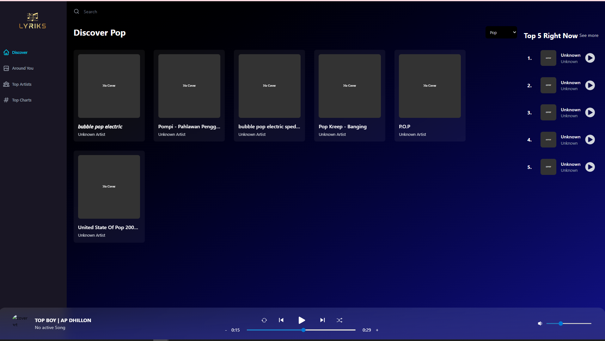
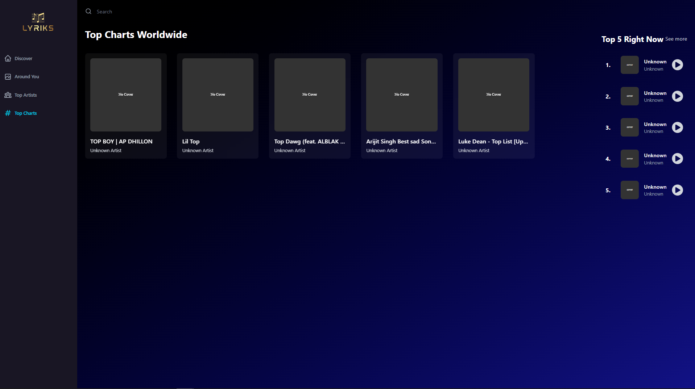
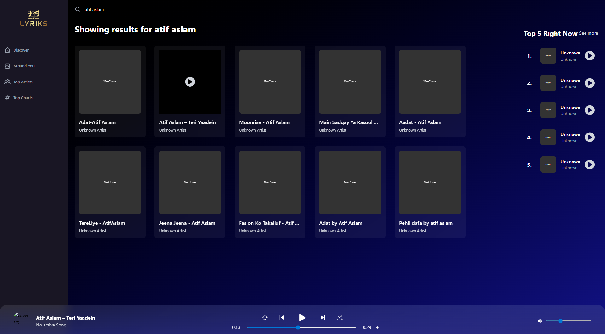

# Lyrics Music Application

<p align="center">
  
</p>

## ❓ Why
This project was created to provide a seamless and engaging music discovery experience. By leveraging modern web technologies and the robust SoundCloud API, it serves as an interactive platform for users to explore new music, track their favorite artists, and view global music trends, all within a beautiful and responsive user interface.

## 🚀 What
The Lyrics App is a full-stack music streaming and discovery web application. It functions as a proxy and client for the SoundCloud API, allowing users to:
- **Discover New Music**: Browse top charts and newly released tracks.
- **Search**: Find specific songs, artists, or genres.
- **Play Audio**: Stream music directly within the app using a persistent, custom-built music player.
- **Explore Artists & Details**: View detailed artist profiles, related tracks, and song information.
- **Localized Content**: See what is popular "Around You" based on your geographic location.

## ✨ Project Showcase

<p align="center">
  
  &nbsp;
  
</p>

### 🛠️ Technologies Used
- **Frontend (`client/`)**: React, Vite, Tailwind CSS, Redux Toolkit, React Router DOM.
- **Backend (`server/`)**: Node.js, Express, Axios (proxy for SoundCloud and Geo APIs).

---

## 🏃 How to Run

The project is divided into two separate directories: `client` (frontend) and `server` (backend proxy). You will need to run both concurrently for the application to work.

### 1. Prerequisites
- Node.js (v16+ recommended)
- npm (comes with Node.js)

### 2. Install Dependencies
Open two separate terminal windows.

**Terminal 1 (Backend):**
```bash
cd server
npm install
```

**Terminal 2 (Frontend):**
```bash
cd client
npm install
```

### 3. Environment Variables
Create a `.env` file inside the `server/` directory with the following keys:

```env
CLIENT_ID=your_soundcloud_client_id
CLIENT_SECRET=your_soundcloud_client_secret
GEO_API_KEY=your_ipify_geo_api_key
PORT=5000        # optional, defaults to 5000
```
*(The server uses these to securely obtain OAuth tokens from SoundCloud and to perform IP-based geo lookups.)*

### 4. Start the Development Servers

**Start the Backend (Terminal 1):**
```bash
# from the server/ directory
npm run dev
```
*(The backend will start on http://localhost:5000)*

**Start the Frontend (Terminal 2):**
```bash
# from the client/ directory
npm run dev
```
*(The frontend Vite proxy is configured to automatically forward `/api/*` requests to the Express server.)*

Visit `http://localhost:5173` (or the port shown in the Vite terminal) in your browser to use the app!

---

## 🧩 Project Structure

```text
lyrics/
├── client/             # Frontend React application
│   ├── public/         # Static assets
│   ├── src/            # React source code (components, pages, redux)
│   ├── package.json    # Client dependencies
│   └── vite.config.js  # Dev server and proxy configuration
├── server/             # Backend Express proxy
│   ├── server.js       # Main express app and API routes
│   └── package.json    # Server dependencies
└── README.md           # This file
```

## 🔧 Common Issues
- **404 errors on `/api/...`**: Ensure the backend is running.
- **Audio playback errors**: Not all SoundCloud tracks provide a playable stream URL. The server will return an error if a track's stream is unavailable.